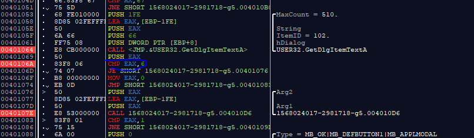
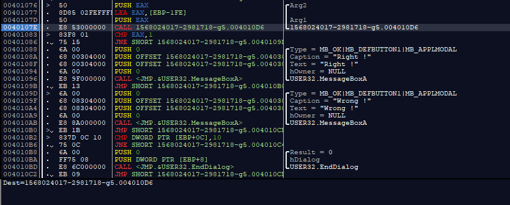
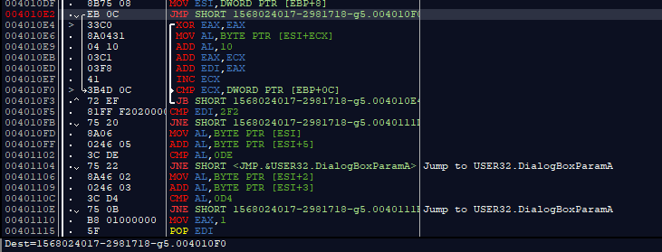



<b>И так, при запуске мы видим запуск программы, получение дескриптора окна и установки DialogBox, куда будет вводится пароль<b>
  
  
  
<b>Дальше видим функцию которая принимает пароль пароль. А после неё видим интересную проверку на число 6. Скорее всего, это длина нашего пароля! Если мы введем пароль, который меньше или больше шести, то нас почти сразу перекинет на адрес команды, которая вызвает окно Wrong!<b>
  
  
  
<b> Если всё хорошо, то в EAX запишется адрес нашей строки, дальше мы видим как сразу после этого вызывается какая-то фукнкция! А после неё провка EAX на единицу. Хм... что же там?
  
    
Мы можем заметить некий цикл где работает некоторый алгоритм проверки пароля, я его тут расписывать не буду, т.к. есть исходный код. В кратце мы берем каждый элемент строки, прибавляем к нему 16, прибавляем счетчик цикла и полученым результат прибавляем к регистру EDI
(хотя ладно, это и есть весь алгоритм). 
Дальше идет проверка полученого результата на число 0x2f2, вроде всё! Но нет...
Смотрим дальше! Видим, что в AL прибавляется 1 элемент массива и последний, после проверяется с числом 0x0De. Интересно, что после этой проверки, в том случае, если она не удалась, приложение крашится, т.к нас перекидывает на адрес ниже возврата из функции, как я понял.
Последняя проверка прибавляет 3 и 4 значения строки, и проверяет их сумму на число 0x0D4.
Если все хорошо, то в eax запишется число 1, то что нам и надо. 
Ведь если проверка на единицу прошла успешно, нас перекидывает на адрес вызова окна с надписью "Right"

  
  
